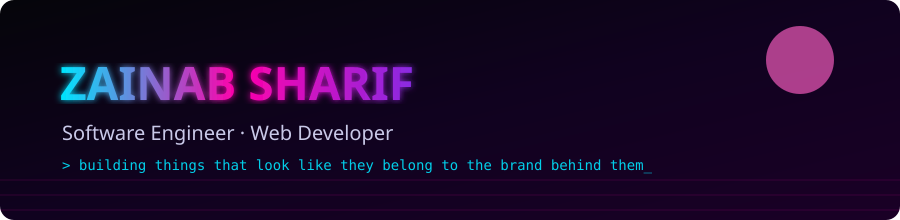

 

## ✦ About

I'm a software engineer working across full-stack, frontend, and product design. I treat design as part of the function, not an add-on — every project is themed around the idea behind it, not just wired up underneath.

I'm also a **Graphic Design Officer** for the Career Counselling Society and the ACM Student Chapter, and I take on freelance web development work.

## ✦ Tech Stack

## ✦ Currently Building

**Everway** — a SaaS accessibility platform for blind/low vision, deaf/hard of hearing, and non-speaking users, built with Next.js and Supabase, with local language support (Urdu/Punjabi) as a key differentiator.

## ✦ Featured Projects

**🎬 MoodFlix** — A mood-driven, retro-synthwave recommendation engine for movies, anime, and music, with a 3D carousel built in Three.js.
**[Live](https://zainabsharif.github.io/MoodFlix/)** · **[Repo](https://github.com/zainabsharif/MoodFlix)**

**💎 DelicateStones** — A themed brand website built for a real freelance client — a handmade jewelry showcase with WhatsApp ordering and a built-in FAQ assistant.
**[Live](https://zainabsharif.github.io/Delicate-Stones/)** · **[Repo](https://github.com/zainabsharif/Delicate-Stones)**

**⏱️ Pomodoro Timer** — A focus timer with session tracking, task checklists, and persistent history, fully responsive from mobile to desktop.
**[Live](https://zainabsharif.github.io/Pomodoro-Timer/)** · **[Repo](https://github.com/zainabsharif/Pomodoro-Timer)**

**📚 Nexus E-Library** — A full-stack research platform with role-based access, similarity-based plagiarism detection, and activity-driven recommendations.
**[Repo](https://github.com/zainabsharif)**

**🎨 Zainab Sharif Portfolio** — My personal portfolio site, showcasing selected projects across full-stack, frontend, and game development.
**[Live](https://zainabsharif.github.io/Zainab-Sharif-Portfolio/)** · **[Repo](https://github.com/zainabsharif/Zainab-Sharif-Portfolio)**

### Let's build something.

© 2026 Zainab Sharif — Lahore, Pakistan

